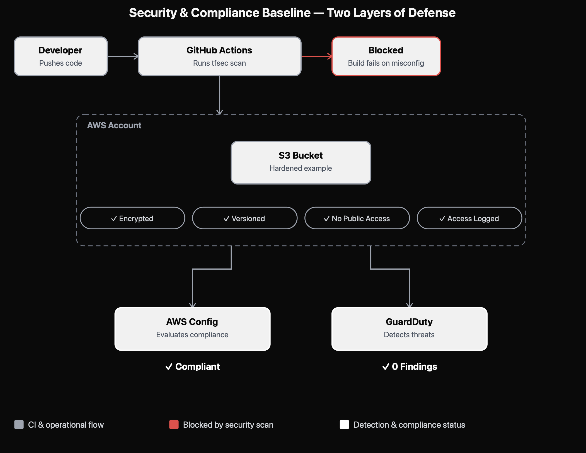
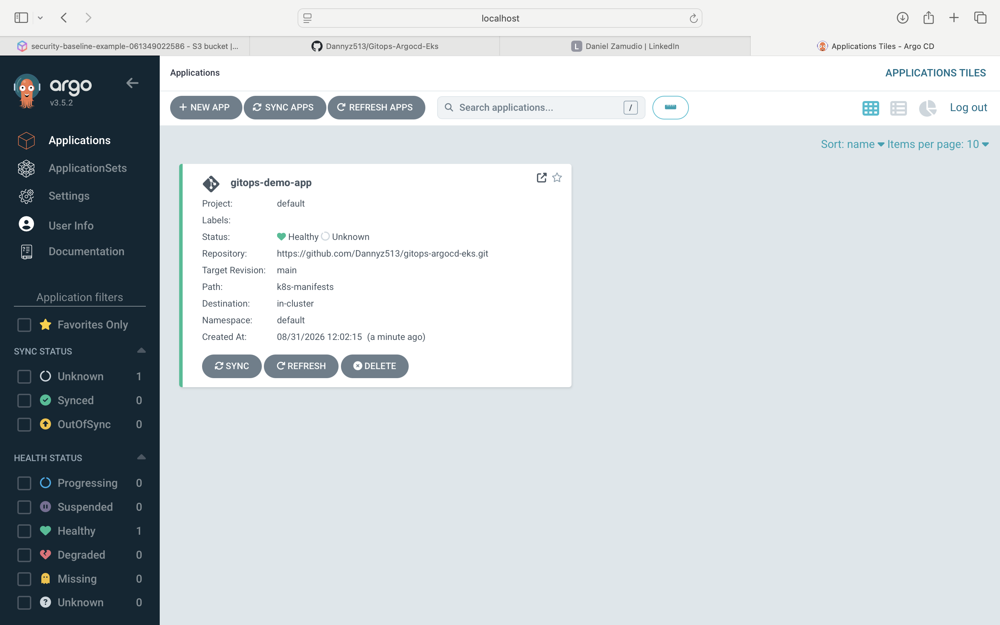
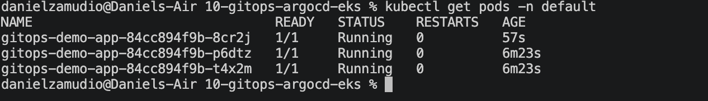

# 🔄 GitOps Deployment with ArgoCD on EKS

> This was the hardest debugging session in this entire portfolio — three separate, genuinely non-obvious issues stacked on top of each other before this actually worked. Every one of them is documented below because that's the part that actually proves I understand the system, not just that I can follow an install guide.

A demonstration of **pull-based deployment** — the GitOps model — running on Amazon EKS with Fargate. Instead of a CI/CD pipeline pushing changes into the cluster from outside, **ArgoCD runs inside the cluster and continuously pulls from Git**, automatically reconciling the live state to match what's declared in the repo. Git becomes the single source of truth; rolling back is `git revert`, not remembering which pipeline run to re-trigger.

**Full design document, including the push-vs-pull reasoning:** [`DESIGN.md`](./DESIGN.md)


---

## Architecture



- **EKS cluster with Fargate**, profile covering `default`, `kube-system`, and `argocd` namespaces from the start
- **ArgoCD**, installed via Helm/official manifests, running entirely inside the cluster
- **An ArgoCD Application resource** pointing at this same repository's `k8s-manifests/` folder — the repo is simultaneously the Terraform code, the Kubernetes manifests, and the documentation
- **Automated sync with self-healing**: if someone manually changes a live resource, ArgoCD reverts it back to match Git — actively enforcing the source of truth, not just detecting drift

## Real Bugs I Debugged (In the Order I Hit Them)

**1. Dex server stuck in `CrashLoopBackOff`.** ArgoCD ships with an optional SSO component (Dex) that crashes on startup if no external identity provider is configured — which is correct, expected behavior when you're only using ArgoCD's built-in admin login, not a bug. Fixed by explicitly scaling it to zero replicas.

**2. `argocd-repo-server` stuck in a restart loop, application sync stuck on `Unknown`.** The repo-server does CPU-intensive work at startup (generating TLS certs, building a GPG keyring), and Fargate's default resource allocation wasn't enough for it to respond to its health checks before Kubernetes killed and restarted it — an endless loop. Fixed by explicitly patching its CPU/memory requests and limits.

**3. Same resource-sizing issue, but on `argocd-application-controller`.** After fixing the repo-server, sync status remained `Unknown` — logs revealed the same startup-timing problem was affecting the component that actually computes sync status. Patched its resources too.

**4. CoreDNS stuck permanently `Pending`, breaking all in-cluster DNS.** Even with both ArgoCD components properly resourced, sync stayed `Unknown` — because the application-controller couldn't resolve `argocd-redis` by name at all. Root cause: CoreDNS pods were created before the Fargate profile was fully attached to the cluster, so they never received the Fargate scheduling toleration and were stuck with nothing to run on. Fixed by deleting them and letting Kubernetes recreate fresh ones onto the now-ready Fargate capacity.

After all four fixes, the application reached `Synced` / `Healthy`, and a real Git push (bumping replica count from 2 to 3) triggered an automatic scale-up with zero `kubectl apply` — the actual GitOps promise, proven end to end.

## What This Demonstrates

- Understanding both major CI/CD paradigms (push, from earlier ECS/EC2 projects in this portfolio, and pull, here) and being able to articulate the real trade-offs
- Practical, hands-on ArgoCD/GitOps experience — not just conceptual knowledge
- Deep comfort diagnosing Kubernetes issues via `kubectl describe`, `kubectl logs`, and events — across four genuinely different root causes in one session
- Recognizing that EKS Fargate has real, documented quirks (resource sizing, Fargate-profile timing) that differ from EC2-backed clusters, and knowing how to work through them systematically rather than giving up

## Proof It Works

**ArgoCD connected to the GitHub repository, application synced:**


**A real Git push (2 → 3 replicas) automatically scaled the running app — no manual deployment step:**


## Usage

```bash
terraform init
terraform plan
terraform apply
```

Connect and install ArgoCD:
```bash
aws eks update-kubeconfig --region us-east-1 --name gitops-argocd
kubectl create namespace argocd
kubectl apply -n argocd -f https://raw.githubusercontent.com/argoproj/argo-cd/stable/manifests/install.yaml --server-side
kubectl scale deployment argocd-dex-server -n argocd --replicas=0
```

Patch resource sizing for Fargate (see the debugging notes above for why this is necessary):
```bash
kubectl patch deployment argocd-repo-server -n argocd --type='json' \
  -p='[{"op": "add", "path": "/spec/template/spec/containers/0/resources", "value": {"requests": {"cpu": "500m", "memory": "1Gi"}, "limits": {"cpu": "1", "memory": "2Gi"}}}]'

kubectl patch statefulset argocd-application-controller -n argocd --type='json' \
  -p='[{"op": "add", "path": "/spec/template/spec/containers/0/resources", "value": {"requests": {"cpu": "500m", "memory": "1Gi"}, "limits": {"cpu": "1", "memory": "2Gi"}}}]'
```

Apply the Application resource:
```bash
kubectl apply -f k8s-manifests/argocd-application.yaml
```

Tear down when finished:
```bash
kubectl delete -f k8s-manifests/argocd-application.yaml
terraform destroy
```

## Cost

EKS control plane: flat $0.10/hour (~$2.40/day) regardless of usage. Plus NAT Gateway (~$0.045/hr). Not free-tier eligible — destroy promptly after testing.

## Tech Stack

**Terraform** 1.15 · **Kubernetes** (EKS, Fargate) · **ArgoCD** · **AWS** (EKS, VPC, IAM)
